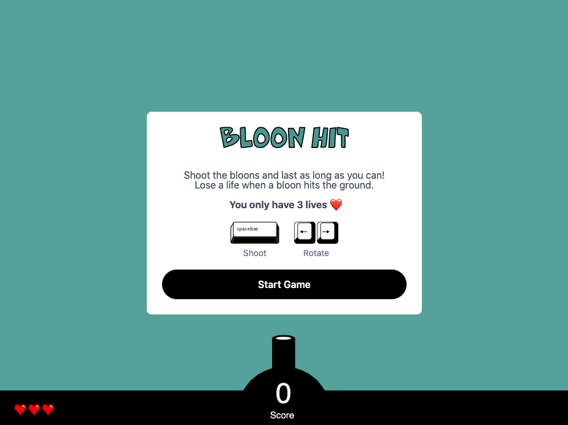
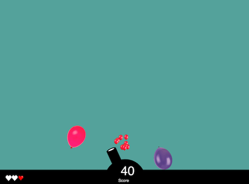

# Bloon Hit 🎈
Shoot falling balloons and watch them burst into bloon-confetti. Made with Phaser, a HTML5 game framework and Matter.js.

### 1. Starting screen

### 2. Burst that bloon
Bloons are successfully burst when hit by a projectile, but only before they hit the 'floor'. The projectile - a small white circle - is animated to move across the screen by changing its position every few milliseconds. This is dependent on the cannon angle, which is tracked as a variable using trigonometry within the JavaScript code.

Each hit of a bloon spews out either tiny balloon confetti, or mini skulls. It depends on whether the bloon has hit the floor already. Each time a balloon hits the floor, a 'life' is deducted (as show from the bottom left of the screen, where the 3 hearts are). A player has 3 lives in each game session.

### 3. All 3 lives lost - game ends
Once 3 bloons have touched the 'floor', the game ends.

